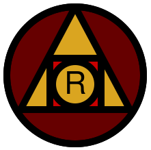

#  Redgold

[Website](https://redgold.io) |
[Contributing](https://dev.docs.redgold.io/contribute/guide) | 
[Dev Setup](https://dev.docs.redgold.io/contribute/dev-setup) | 
[Whitepaper](https://dev.docs.redgold.io/whitepaper/whitepaper) | 
[Run A Node](https://dev.docs.redgold.io/guides/node-setup) | 
[Security Procedures](https://dev.docs.redgold.io/introduction/security-procedures)

Redgold is a crypto portfolio contract platform designed around data lake transforms and executors. 
Uses multiparty native contracts for asset management. Primary use case is ETFs & Portfolio target models (expressing a desired 
portfolio allocation as a function and having validators automatically fulfill it,) but the platform is designed to 
be general purpose as a decentralized data lake and relational algebra compute engine for crypto related contracts.

Heavily inspired by Spark and pandas/polars like data transformations on conventional 
parquet data lakes, with the key distinguishing factor being the ability to support multi-tenant compute with 
arbitrary secure UDFs compiled by anyone. WASM executors are used for secure remote code execution to chain together
transforms operating on SQL-like data loading functions as inputs. Protobuf is used for relational algebra descriptors 
and for raw signature operations and requests. Arrow is used as a cross-memory format for WASM invocations, with sqlite 
tables for frequent access and parquet tables for long-lived data indexes. All operations are translated to work 
with Kademlia distances. [ACCEPT](https://arxiv.org/pdf/2108.05236.pdf) consensus protocol is the most similar 
to the demonstrated primary optimization technique. For a full technical description and motivation of this project 
please refer above to the [whitepaper](https://dev.docs.redgold.io/whitepaper/whitepaper).

* This project is still in experimental development but has a live mainnet.

